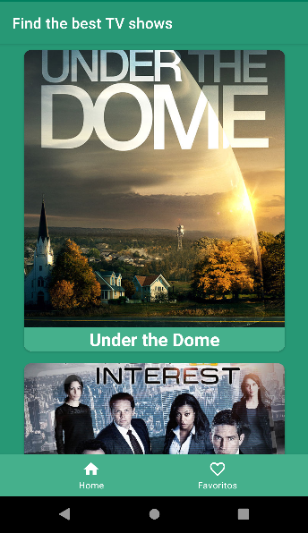
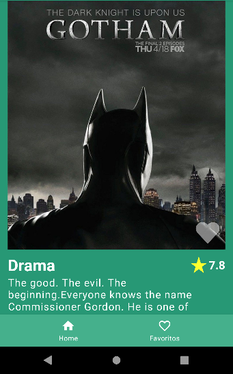
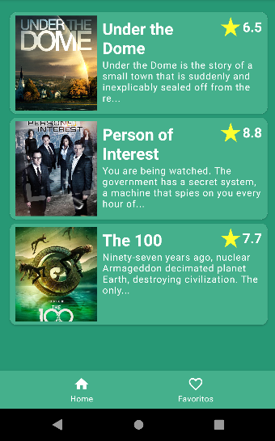

# TvShowsMVVM

I built this project with the goal of learning some essencial tools for Android development:
* Architecture (MVVM)
* Dependency Injection (Hilt)
* Api Requests (Retrofit)
* LiveData
* Navigation

##### Home Screen
The home screen of the app is the list of Tv Show that we get from the TV Maze API: https://www.tvmaze.com/api

##### Details Screen
On that screen we have the details of one TV Show, the user can get here by clicking 
on the TV Show of the list in the Home Screen or the Favorites Screen.

##### Favorites Screen
Here the user can see the TV Shows that are market as favorites, a TV Show can be marked 
favorite by clicking on the heart image in the bottom of the TV Show image in the details screen.

